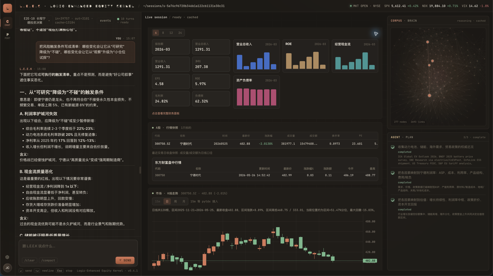

[English](README.EN.md) | [中文](README.md)

# L.E.E.K

**Logic-Enhanced Equity Kernel** is an independently developed financial research agent product. It brings together a language-model agent, a curated investing corpus, market-data tools, web research, canvas-based evidence, and an auditable harness so an investment question can move from loose curiosity to structured research, adversarial checks, and action constraints.



L.E.E.K is not a generic chatbot. The point is not to paste tool outputs into polished prose. The product is designed to expose how the agent researches: why it searches, what it finds, what is still missing, and how facts become judgment. The chat stays concise, while the canvas carries tool cards, reasoning traces, financial tables, candlesticks, web evidence, and corpus activation.

The project is currently an early alpha. The end-to-end flow runs, but analysis quality, tool coverage, frontend UX, and long-horizon reliability are still being hardened. L.E.E.K is not an investment-advice system and does not replace personal judgment, licensed advice, or formal risk management.

## Product Goal

L.E.E.K is built for individual investors and researchers who want a serious research workflow rather than another answer box. It targets failure modes common in ordinary LLM agents:

- Summarizing data without building a real research frame.
- Forgetting evidence already collected in the previous turn.
- Jumping to buy/sell language without discussing permanent loss, circle of competence, or opposing evidence.
- Treating web search, financials, market data, and investing principles as disconnected fragments.
- Drifting, stopping too early, or handing unfinished research back to the user during long tasks.

The goal is a financial research harness that makes the model behave more like a research analyst and less like a report-writing prompt template.

## Core Capabilities

- **Local agent gateway**: a Rust long-running service for sessions, event streaming, tool execution, vault state, and LLM providers.
- **Chat-canvas workbench**: chat on the left, research evidence in the center, corpus brain and plan state on the right.
- **A-share-first tools**: company profile, financials, quotes, candlesticks, capital flow, industry context, indices, funds, macro context, and research-source discovery.
- **Corpus grounding**: retrieval over a curated investing corpus so Buffett / Munger / Dalio style principles become research constraints, not decorative quotes.
- **Reasoning trace**: UI events for intermediate research intent, so users can see how the agent is moving through the task.
- **Plan and subagent foundations**: long tasks can create plans, delegate research, and feed progress back into the session.
- **Append-only session vault**: messages, tool calls, plans, LLM usage, and canvas events are persisted to local SQLite for audit, debugging, and evals.
- **Prompt-cache optimization**: Codex backend session identity and cache keys are wired in, materially improving cache hit rate across long tool loops.

## Architecture

```text
frontend/web        SolidJS + Vite web workbench
crates/gateway      Rust gateway, CLI, API, agent loop, tools, vault
corpus/             Investing principles and knowledge corpus
harness/            Agent identity, discipline, and corpus orientation
tests/              A-share E2E eval cases and test records
design/             Architecture notes, decisions, and historical design docs
```

Runtime is organized around four layers:

1. **Agent harness**: context construction, tool-use policy, plan tracking, and provider-error recovery.
2. **Tool layer**: a small set of high-leverage tools for market data, web evidence, corpus retrieval, financials, and research sources.
3. **Vault**: local SQLite state for sessions, events, messages, tool calls, plans, and provider configs.
4. **Workbench UI**: a readable research surface for chat, reasoning, tool evidence, and corpus state.

## Local Setup

Build the gateway:

```bash
cargo build -p leek-gateway
```

Configure the Codex provider on first use:

```bash
cargo run -p leek-gateway -- --vault tmp/dev/vault.db auth codex
```

Start the gateway:

```bash
cargo run -p leek-gateway -- --vault tmp/dev/vault.db serve --port 8964
```

Start the frontend in another terminal:

```bash
npm --prefix frontend/web install
npm --prefix frontend/web run dev -- --host 127.0.0.1 --port 5173
```

Open:

```text
http://127.0.0.1:5173
```

For a one-shot provider smoke test:

```bash
cargo run -p leek-gateway -- --vault tmp/dev/vault.db chat "Introduce L.E.E.K in one sentence."
```

## Data and Configuration

- `--vault` points to the local SQLite vault for runtime user state.
- A-share tools use configured data providers when available. Tushare tokens and similar credentials should live in local config or app settings, never in the repository.
- `corpus/` is the shared investing knowledge layer. The agent reads it by default and should not write session-specific conclusions directly into the formal corpus.
- `tmp/` is for local scratch files, test vaults, and experiments.

## Development Checks

```bash
cargo check -p leek-gateway
cargo test -p leek-gateway
npm --prefix frontend/web run build
```

The fixed A-share eval suite lives at:

```text
tests/a_share_e2e_cases.md
```

Those cases are used to inspect three surfaces: harness reliability, agent research quality, and frontend rendering/order of tool evidence.

## Current Status

Already running:

- Session / event log / SSE / canvas basics.
- Agent loop with tool execution, persistent tool cards, and `tool_call_runs`.
- Plan, subagent foundation, provider retry, prompt cache, and corpus brain.
- First-pass A-share tools for company info, financials, quotes, candlesticks, capital flow, industry, macro, indices, and funds.
- Frontend rendering for reasoning traces, artifact cards, plans, corpus brain, and settings.

Still being hardened:

- Analysis quality needs to move from "tool summary plus smart prose" to a stable research methodology.
- Subagents are not yet a mature, reliable worker system.
- A-share data still needs better minute-level data, live quotes, research reports, announcements, industry data, and alternative capital-flow sources.
- Frontend cards, financial detail views, candlestick interaction, canvas layout, and performance need continued iteration.
- E2E evals need repeated run-log-fix-rerun cycles.

## Product Principles

- L.E.E.K should not rely on rigid output templates. Output should emerge from the task, evidence, and user constraints.
- Simple questions should not force a plan; plans are for complex or long-horizon work.
- Tools should be few, high-leverage, and designed from the agent's point of view.
- Corpus is a thinking framework, not an answer database. If local knowledge does not cover a domain, the agent should build a temporary working model through research.
- Any final action must respect user constraints around position size, risk tolerance, and permanent loss.

## Disclaimer

L.E.E.K is a research tool, not financial advice. Outputs may be wrong, and market data may be delayed, incomplete, or sourced from third parties. Users are responsible for their own investment decisions and risks.
